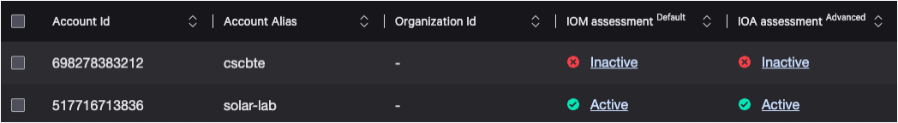

Cloud Security Lab Series
# AWS CSPM Registration 101
## Chapter 1 - What is AWS CSPM Registration?

CSPM Registration refers to the process of granting limited, read-only access to your cloud account to enable CrowdStrike Cloud Security features such as:
- Configuration Assessments: monitor for indicators of misconfiguration (IOM) that could pose a security risk or violate compliance controls.
- Behavior Assessments: identify patterns of behavior or indicators of attack (IOA) in near real time.
- Cloud asset inventory: see your cloud assets deployed across all environments in a single view.
- Automated Remediation: remediate misconfigurations in your environment with easy-to-configure workflows.

Before we dive into how registration works, it is important to understand what is happening when a customer **registers** and **onboards** their cloud account.

**Registration** occurs when an AWS account ID (and/or Organization ID) is registered to the customer’s Falcon CID.  This can be done via API, Guided Registration in the Falcon Console, or AWS Built-In for Control Tower.  Once this is done CrowdStrike begins performing a health check against the account for the required resources.  This is why you may see the account as **Inactive** in the Falcon console.  This means the account is registered but not yet onboarded because it does not yet have the required resources, or they are not configured properly.

**Onboarding** is complete when the registered account has the required resources, configured correctly, for Falcon Cloud Security to pass the health check and function.  At this point the account will be **Active** in the Falcon console.

In this example both accounts are registered but only solar-lab has been onboarded.

In this case the inactive account `cscbte` could be in one of the following states:
1. The account was registered and onboarded recently, the health check needs more time to pass.
2. The account was registered but onboarded unsuccessfully, resource deployment failed or with wrong configuration.
3. The account was registered with this CID, but no resources have been deployed yet so the account is not onboarded.

In the next chapter we will discuss what is actually happening at the API level when registerring an account.

[Continue to Chapter 2](./chapter2.md)

[Back to Table of Contents](../README.md)