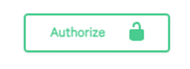
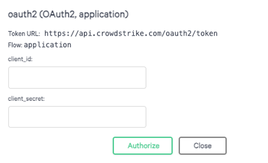
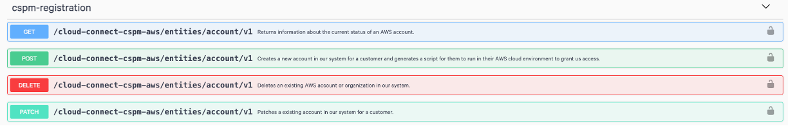
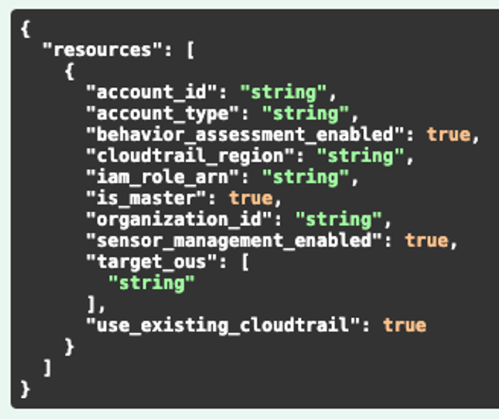
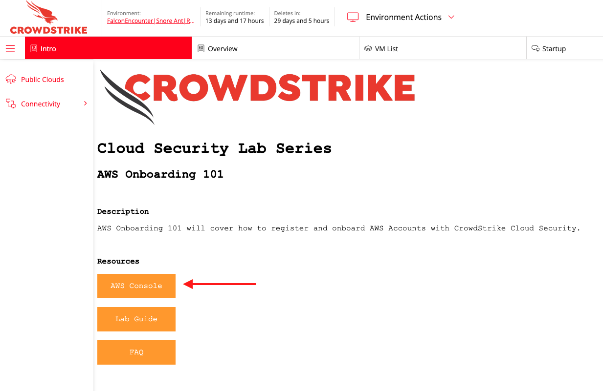
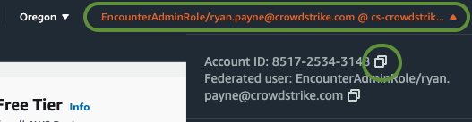
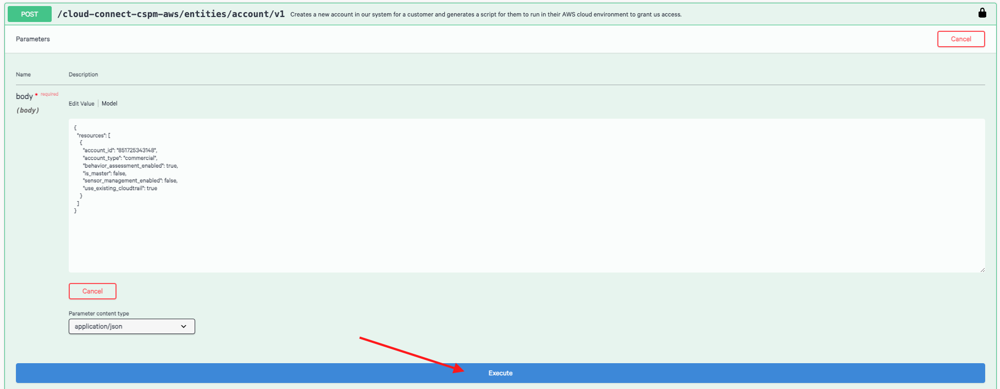
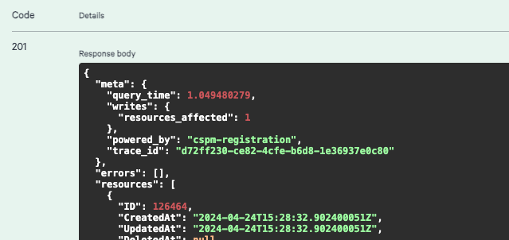
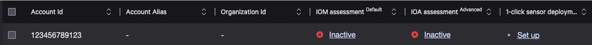
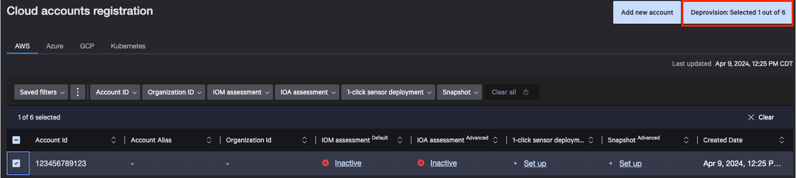

Cloud Security Lab Series
# AWS CSPM Registration 101
## Chapter 2 - Using the cspm-registration API

To understand how CSPM registration actually works, we first need to review the registration API endpoint.  Regardless of the registration method your customer chooses (bash, terraform, single account, org, etc.), our OAuth2-Based API endpoint for CSPM Registration is called to make the magic happen:
`/cloud-connect-cspm-aws/entities/account/v1`

This endpoint allows four different methods: GET, POST, PATCH & DELETE

**GET**: return information about the status of an account  
**POST**: Register a new account with a Falcon CID  
**PATCH**: Update an existing account  
**DELETE**: Remove an existing account from Falcon CID  

This API endpoint is how we tell Falcon to register an AWS Account ID with the desired Falcon CID as well as configure what CSPM features are enabled for the account.  In most cases the customer will not interact directly with this endpoint, but we should to fully understand what information is required to register a cloud account, and what information is returned upon registration.

### Swagger
Make sure you are currently logged into the Falcon console, then navigate to the CrowdStrike Swagger page per your Falcon Cloud:  
[US-1](https://assets.falcon.crowdstrike.com/support/api/swagger.html)  
[US-2](https://assets.falcon.us-2.crowdstrike.com/support/api/swagger-us2.html)  
[EU-1](https://assets.falcon.eu-1.crowdstrike.com/support/api/swagger-eu.html)

**Authenticate with your Falcon API Credentials**
1. Click Authorize on the right



2. In the oath2 section, enter your Falcon API credentials and click Authorize



3. click close

**Review the cspm-registration API**
1. Scroll down to cspm-registration



2. Click on POST and review the body of the API call.



3. attribute details

|attribute|description|type|valid values|
|---|---|---|---|
|account_id|AWS AccountID to register|string|AWS Account ID eg. “123456789123”|
|account_type|AWS Account Type|string|“commercial” or ”govcloud”|
|behavior_assessment_enabled|Enable IOAs|bool|true or false|
|cloudtrail_region|AWS Region for CloudTrail (if use_existing_cloudtrail = false)|string|AWS region code eg. “us-east-1”|
|iam_role_arn|CSPM ReadOnly IAM Role ARN (if customer requires custom IAM Role Name)|string|AWS IAM Role ARN|
|is_master|Whether AWS AccountID is management account of Organization|bool|true or false|
|organization_id|AWS Organization ID|string|AWS Organization ID eg. “o-abc123”|
|sensor_management_enabled|Enable OneClick|bool|true or false|
|target_ous|AWS Organization OUs to register|array of string|List of AWS Organization OUs eg. [ “ou-abcd-1234”, “ou-defg-5678”]|
|use_existing_cloudtrail|Whether to use existing CloudTrail for ReadOnly IOAs|bool|true or false|

### Try it out
1. click **Try it out** and modify the body to match the below configuration
```
{
  "resources": [
    {
      "account_id": "$my_account_id",
      "account_type": "commercial",
      "behavior_assessment_enabled": true,
      "is_master": false,
      "sensor_management_enabled": false,
      "use_existing_cloudtrail": true
    }
  ]
}
```
2. Navigate back to CloudShare and click **AWS Console**



3. In the AWS Console, click your IAM Role in the top right.  Then click the copy icon next to the account id.



4. Navigate back to Swagger, Replace `$my_account_id` with the account id you copied in step 2.
5. Click **Execute**



6. Scroll down to view the response `Code 201: Created`

  

### Review the API Response
In the body of your response you will see many attributes relevant to the registration process.  For the purposes of this lab we will focus on a few key attributes.
|attribute|purpose|
|---|---|
|iam_role_arn|The Read Only IAM Role CrowdStrike requires in the customer’s account to enable IOMs (commonly referred to as the “reader role”).  Because we did not supply an iam_role_arn in our request, the CrowdStrike API returns an autogenerated IAM Role ARN.|
|intermediate_role_arn|The IAM Role CrowdStrike uses to perform STS:AssumeRole into the customer’s account to enable IOMs.  This must be in the trust policy of the reader role.|
|external_id|The external ID that ensures only CrowdStrike can perform STS:AssumeRole into the customer’s account against the reader role. This must be in the trust policy of the reader role.|
|aws_eventbus_arn|The CrowdStrike EventBus that EventBridge rules in the customer’s account will target to enable IOAs.|
|behavior_assessment_enabled|This shows ‘true’ which confirms IOAs are enabled for this account|
|sensor_management_enabled|This shows ‘false’ which confirms OneClick is not enabled for this account.|
  
Now that your AWS Account is registered, navigate to the [Cloud Account Registration page](https://falcon.crowdstrike.com/cloud-security/registration) in your Falcon console.  Your AWS Account ID should be listed and look like this:
  

From this page we can confirm a few details about this account:
1. the account is now registered but it has not yet been onboarded because nothing shows Active
2. IOAs were enabled during registration because it shows Inactive
3. OneClick was not enabled during registration because it shows "Set up"

### Cleanup
**Before you proceed:** please deprovision the account we just registered.
1. Tick the check box next to your AWS Account ID
2. Click Deprovision in the upper right.



3. Click Confirm
4. Ignore the “To remove Cloud Security Posture resources from your AWS environment, do the following:” page and click close.  We don’t need that step because no resources have been provisioned.

[Continue to Chapter 3](./chapter3.md)

[Back to Table of Contents](../README.md)