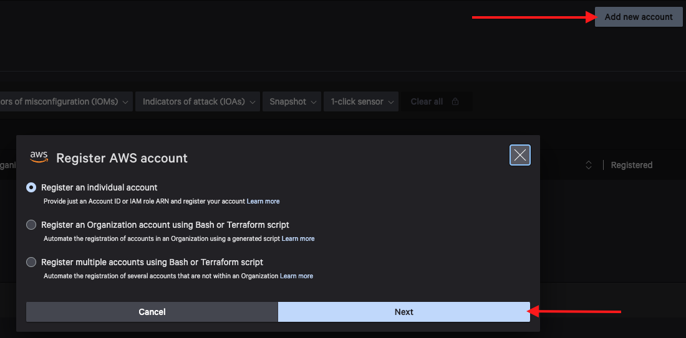
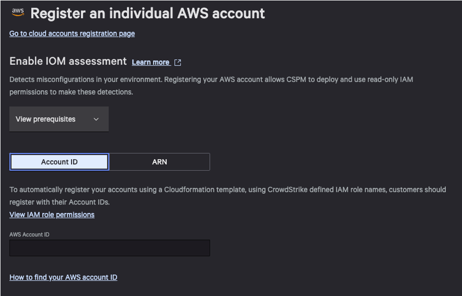
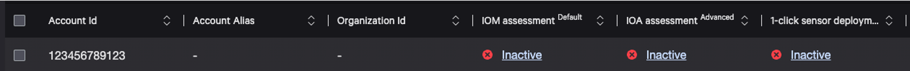
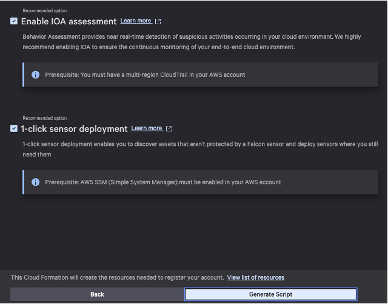
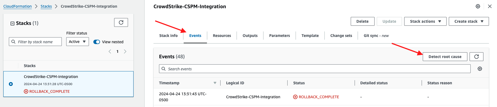

Cloud Security Lab Series
# AWS CSPM Registration 101
## Chapter 3 - Guided Registration via Falcon Console

Now that we understand how the API works, we can review how most customers will onboard their AWS Accounts: Guided Registration via the Falcon Console.  

### Add Account
1. Navigate to the [Cloud Account Registration page](https://falcon.crowdstrike.com/cloud-security/registration) and click **Add new account**
2. Select Register an individual account and click next.



**Note**: While most customers will use “Register an Organization”, we can only register a single account in this lab environment.  In a later chapter, we will review how this process works in an Organization context.
3. Enter your Falcon API Credentials and click next


On the Enable IOM assessment page you are presented with two options: Account ID and ARN



**Account ID** means you will not be providing a custom IAM Role ARN and the API will autogenerate the IAM Role name.  This is the equivalent of the iam_role_arn attribute in our API call earlier.

**ARN** means you will create the role in your AWS Account prior to registration.  This allows the customer to define the IAM Role name, which could be required if the customer has AWS Service Control Policies (SCPs) in place to specify role naming conventions.  If you select ARN you are presented with the required steps to create the IAM role and proceed.  For now, continue to step 4.

4. **Select Account ID**, paste your AWS Account ID and click **next**.
  
You will see a success message in the top right.  If you instead get an error like "Account ID is already in the CrowdStrike Database".  Please complete the Cleanup phase of [Chapter 2](./chapter2.md)

You are now presented with Enable IOA assessment and 1-click sensor deployment. At this point we have effectively registered the account, just as we had with the API previously.  If you did nothing else the AWS Account ID will still show in the Cloud Account Registration page with IOM, IOA and OneClick enabled but inactive.



5. Leave both options selected and click generate script.



### Onboarding the Account
A CloudFormation template has been generated with all of the relevant details.  You are presented with two options **Go to AWS Console** and **Copy CloudFormation link**  
- Go to AWS Console is a quick-create link that will resolve to CloudFormation/Stacks/CreateStack in your current AWS Console with the template and parameters preloaded.
- Copy CloudFormation link will copy the quick create URL with parameters preset if you want to launch the template later.  This URL will contain the Falcon API credentials in plain text so use caution when storing or sharing these links.

1. Make sure you are still currently logged into your AWS Account in another tab, then click **Go to AWS Console**
2. Review the Quick create stack page

**Template**: Notice the Template URL is an S3 bucket.  If you need to review or provide this template you can copy and paste this URL in your browser.  
**Provide a stack name**: We recommend leaving this value default, but you may change this if desired.  
**Parameters**: The only values that can be changed at this point are APICredentialsStorageMode, EnableIOA and EnableSensorManagement. More details below:

|Parameter|Description|Service|
|---|---|---|
|APICredentialsStorageMode|Whether to store API Credentials in Secret or Lambda (env variables).  Secret is strongly recommended because Lambda Env variables will be stored as plaintext, but customer may choose Lambda if cost is a concern.  |Sensor Management (OneClick)|
|CSAccountNumber|Do Not Change - CrowdStrike Account ID will be added to Reader Role trust policy (IOMs) and target EventBus ARN (IOAs)| IOMs and IOAs|
|CSBucketName|Do Not Change - CrowdStrike BucketName if customer chooses to use CloudTrail to enable ReadOnly IOAs|IOAs|
|CSEventBusName|Do Not Change - CrowdStrike EventBus target will be added to EventBridge Rules for mutating IOAs|IOAs|
|CSRoleName|Do Not Change - CrowdStrike IAM Role will be added to Reader Role trust policy|IOMs|
|ClientID|Do Not Change - Your Falcon API Client ID|Sensor Management (OneClick)|
|ClientSecret|Do Not Change - Your Falcon API Client Secret|Sensor Management (OneClick)|
|EnableIOA|Whether to deploy IOA resources including IAM Role and EventBridge Rules|IOAs|
|EnableSensorManagement|Whether to deploy Sensor Management resources including IAM Roles and Lambda|Sensor Management (OneClick)|
|ExternalID|Do Not Change - CrowdStrike external ID will be added to Reader Role trust policy|IOMs|
|RoleName|Do Not Change - Reader Role will be created with this name which is required to pass IOM healthcheck|IOMs|
|UseExistingCloudtrail|For ReadOnly IOAs: Whether to use existing cloudtrail to target CrowdStrike S3 bucket or create a new dedictaed CloudTrail |IOAs|

**Permissions**: AWS allows you to select an IAM role for CloudFormation execution if applicable.  
**Capabilities**: This notice requires we acknowlege that this template will create IAM entities with custom names.  

3. Leave all values default and click **Create Stack**

### Troubleshooting Permissions Boundary
If you did everything correctly, you should see you stack has failed!  After a moment the stack should enter the `ROLLBACK_COMPLETE` state.  This means a resource has failed, and whatever has been provisioned thusfar has been deleted or "rolled back".  In this state we can only review the logs and delete the stack before trying again.  

**Why did this happen?**  
Like many customer cloud environments, our lab environment is not exactly compatible with the CloudFormation generated by the Falcon console.  Let's review how to determine a root cause in CloudFormation.

1. Review the Events Tab of your stack.
2. Notice the list of events is in cronological order going from latest to oldest.
3. Click **Detect root cause** to automatically scroll to the first failure.



4. The root cause is an IAM Role failed to create.  Under `Status reason` we can see why.

Example Status Reason:
```
Resource handler returned message: "Encountered a permissions error performing a tagging operation, please add required tag permissions. See https://repost.aws/knowledge-center/cloudformation-tagging-permission-error for how to resolve. Resource handler returned message: "User: arn:aws:sts::590183855808:assumed-role/EncounterAdminRole/your.name@crowdstrike.com is not authorized to perform: iam:CreateRole on resource: arn:aws:iam::590183855808:role/CrowdStrikeSensorManagement with an explicit deny in a permissions boundary (Service: Iam, Status Code: 403, Request ID: a283ee92-8a01-476e-b1f6-21b5887abd2d)"" (RequestToken: 49e06032-8780-edc7-809c-75afc7d4328e, HandlerErrorCode: UnauthorizedTaggingOperation)
```

An explicit deny in a permissions boundary is preventing our IAM Role `EncounterAdminRole` from making the `iam:CreateRole` call against the AWS API.  We executed the CloudFormation CreateStack operation with our IAM Role, that stack creates new IAM Roles, and this permissions boundary prevents our IAM Role from completing that operation.

5. Let's review the permissions boundary.  Goto IAM, select Roles and click on **EncounterAdminRole**.
6. Expand the Permissions boundary (set) section and click on **BoundaryForAdministratorAccess**
7. You should land on the permissions page of the policy.  Under Permissions defined in the policy, look at the Explicit Deny section.
8. We failed on an iam:CreateRole call. Click on **IAM**
6. On this page we can see actions that are denied.  CreateRole is listed with a request condition.  It should look like this:

```
CreateRole    RoleName|string like|All    iam:PermissionsBoundary !== arn:aws:iam::590183855808:policy/BoundaryForAdministratorAccess
```

This means we cannot create any IAM Roles in the account unless the role has the permissions boundary attached.

8. Navigate back to CloudFormation and select our failed stack.
9. Click on the Template tab and review the IAM Roles in the resources section of the template code.

You will notice there is no PermissionsBoundary attribute on any of these roles.  Now we can confirm why the stack failed.  Under the conditions of the permissions boundary attached to our current IAM Role, we cannot create roles unless that permissions boundary is attached to the new roles.  We need to update this template!

**If you are using Commercial Falcon** [Continue to Chapter 4](./chapter4.md)
**If you are using GovCloud Falcon** [Continue to Chapter 5](./chapter5.md)

[Back to Table of Contents](../README.md)