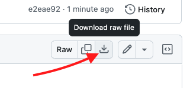

Cloud Security Lab Series
# AWS CSPM Registration 101
## Chapter 4 - Using a Custom Template

In this lab we will use a custom template to address the need for a Permissions Boundary attached to all roles which will resolve the failed onboarding phase and complete registration.  But there are many reasons why a customer may want to use an open-source CloudFormation template.  They may want to add tags to every resource, change the name of the EventBridge IAM Role or simply have the code stored in their source control.

Here's a list of what a customer can change in our templates:
- EventBridge Role name
- Tags on Resources
- Permissions Boundary on IAM Roles

Generally speaking we should not indicate that any other aspects of the templates can change because additional changes will likely break the functionality of CSPM.

### Retrieve and Use the Custom Template

1. View the AWS template [here](../code/register-permissions-boundary.json)

This is the same template that is provided in the Falcon Console, but with a conditional Permissions Boundary Attribute applied to all IAM Roles.

2. Click the download icon.

3. Navigate back to CloudFormation in the AWS Console.
4. Select our failed stack and click on the Parameters tab.

Our new template won't have these parameters pre-filled so we will need to enter them in.  To have them handy, we will continue in another tab.

5. Right click on **Stacks** and **Open Link in New Tab**
6. In the new tab, click **Create Stack** and select **With new resources (standard)**
7. Under the specify template section, choose `Upload a template file` then click **Choose file**
8. Upload the template you downloaded in step 2 and click Next
9. Give the Stack a unique Name and fill in the Parameters using the information from your failed stack in the other tab.

**Note**:  Be wary of trailing spaces when copying and pasting information into parameters.  These must be removed to prevent failures.

10. A new Parameter is available `PermissionsBoundary`.  The value should be BoundaryForAdministratorAccess
11. Click Next
12. In the Stack Failure options section of this page, select `Preserve successfully provisioned resources`

This will allow you to easily update the stack if any additional failures occur.

13. Click Next
14. Check the box in the Capabilities section and click Submit

Once this stack finishes, the onboarding phase is complete.

### Confirm Registration

Navigate back to the Falcon Console and check the Cloud accounts registration page.  You should see the IOM, IOA and 1Click services become Active soon. 

[Continue to Chapter 5](./chapter5.md)

[Back to Table of Contents](../README.md)