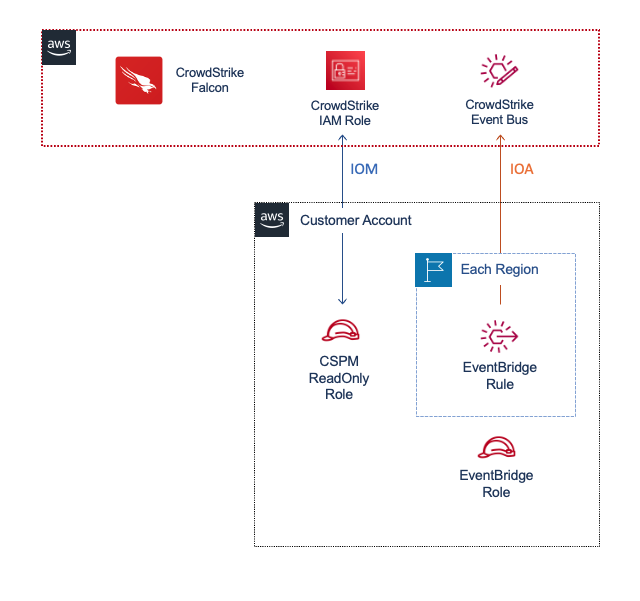
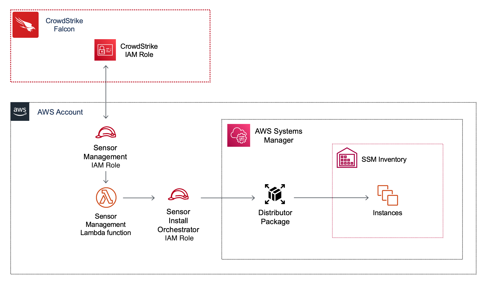

Cloud Security Lab Series
# AWS CSPM Registration 101
## Chapter 6 - CSPM Architecture

The following resources are deployed to onboard a given commercial AWS Account with CrowdStrike CSPM

| Service | Resource Type | Name | Purpose |
|---|---|---|---|
|IOM|IAM Role|CrowdstrikeCSPMReader-{random_id}|The "Reader Role".  Contains trust policy to allow CrowdStrike to sts:AssumeRole into the account and run read-only api calls to generate IOM data|
|IOA|EventBridge Rule|cs-cloudtrail-events-ioa-rule|Send mutating CloudTrail events to CrowdStrike EventBus to generate IOA data|
|IOA|EventBridge Rule|cs-cloudtrail-events-readonly-rule|Send non-mutating CloudTrail events to CrowdStrike EventBus to generate IOA data|
|IOA|IAM Role|CrowdStrikeCSPMEventBridge|IAM Role to allow EventBridge rules to target EventBus in another account|
|IOA|IAM Role|CrowdStrikeCSPMRegistration|**Single Account Registraion Only:** IAM Role for cs-lambda-registration Lambda execution|
|IOA|Lambda Function|cs-lambda-registration|**Single Account Registraion Only:** Lambda function deploys EventBridge rules in each region|
|IOA|Log Group|/aws/lambda/cs-lambda-registration |**Single Account Registraion Only:** Log group for cs-lambda-registration Lambda|
|1Click|IAM Role|CrowdStrikeSensorManagement |Contains trust policy to allow CrowdStrike to sts:AssumeRole into the account and invoke the cs-horizon-sensor-installation-orchestrator Lambda function|
|1Click|IAM Role|CrowdStrikeSensorManagementOrchestrator |Execution role for cs-horizon-sensor-installation-orchestrator Lambda function|
|1Click|Lambda Function|cs-horizon-sensor-installation-orchestrator|When invoked by 1Click, deploys the Falcon distributor package against target instances|
|1Click|Log Group|/aws/lambda/cs-horizon-sensor-installation-orchestrator |Log group for cs-horizon-sensor-installation-orchestrator Lambda function|
|1Click|Secret|CrowdStrike/CSPM/SensorManagement/FalconAPICredentials-{random-id}|Falcon API Credentials for cs-horizon-sensor-installation-orchestrator Lambda function|

Notice some of these resources are specific to Single Account Registration.  Most customers will be using Multi-Account or Organization registration.  We will cover how this process changes in those scenarios in the next chapter. For now, familiarize yourself with the core functionality of CSPM using following architecture diagrams.

### IOMs and IOAs



### Sensor Management (1Click)



### Review Resource Configuration

Now that we understand the basic architecture, let's look at the specific configuration of a few key resources.

#### IAM for IOMs

1. Navigate to the CloudFormation console.  Select your stack and click the `Resources` tab
2. Click the `Physical ID` of the CrowdStrikeCSPMRole
3. Review the Permissions Policies of the role.  There are two: **SecurityAudit** and **cspm_config**

**Security Audit**: an AWS Managed policy that defines most of the read-only calls required for CSPM IOMs to function.  We use this policy because as AWS changes services and/or available readonly api calls, this will automatically update without the customer needing to update their CloudFormation.

**cspm_config**: while the Security Audit policy grants us most of what we need, there are a few readonly api calls that are missing from that policy.  This policy supplements with those missing calls.

4. Click the `Trust Relationships` tab.  Review the trust relationship.

```
{
    "Version": "2012-10-17",
    "Statement": [
        {
            "Effect": "Allow",
            "Principal": {
                "AWS": "arn:aws:iam::292230061137:role/CrowdStrikeCSPMConnector"
            },
            "Action": "sts:AssumeRole",
            "Condition": {
                "StringEquals": {
                    "sts:ExternalId": "a1s2d3f4g5h6j7k8l9a1s2d3f4g6h6j7k8k"
                }
            }
        }
    ]
}
```

This trust policy is what grants the CrowdStrike IAM Role permissions to assume this role and run the readonly calls to generate IOMs.  The principal and external ID ensures that only CrowdStrike can assume this role.

**Note**: the external ID is randomly generated and specific to this registration.  If the account were to be deregistered and reregistered, this external ID would need to be updated.  If a customer ever has the role in place but IOMs are still **inactive**, make sure this external ID is correct by running a GET /cloud-connect-cspm-aws/entities/account/v1 in Swagger.  Make sure this external ID matches the external_id in the output of your API response.

#### EventBridge for IOAs

5. Navigate to the EventBridge console.  Click **Rules** on the left and click **cs-cloudtrail-events-ioa-rule**
6. Click the `Targets` tab and review the target details

The target name/arn shows the CrowdStrike EventBus.  Anytime an event occurs that matches the event pattern, it will automatically be forwarded to CrowdStrike for IOA analysis in near-real time.  This is much faster than competitors solutions that rely on S3 buckets.

**Note**: the CrowdStrike EventBus name is randomly generated and unique for this registration.  If the account were to be deregistered and reregistered, this target ARN would need to be updated.  If a customer ever has the EventBridge rules in place but IOAs are still **inactive**, make sure this target ARN is correct by running a GET /cloud-connect-cspm-aws/entities/account/v1 in Swagger.  Make sure this target ARN matches the aws_eventbus_arn in the output of your API response.

7. Click on the **CrowdStrikeCSPMEventBridge** role in the target details.
8. Review the Permissions Policy of the role, eventbridge-put-events.

```
{
    "Version": "2012-10-17",
    "Statement": [
        {
            "Action": [
                "events:PutEvents"
            ],
            "Resource": "arn:aws:events:*:*:event-bus/cs-*",
            "Effect": "Allow"
        }
    ]
}
```

This policy prevents the EventBridge rule from forwarding events to any EventBus that doesn't match this naming convention.

[Continue to Chapter 7](./chapter7.md)

[Back to Table of Contents](../README.md)